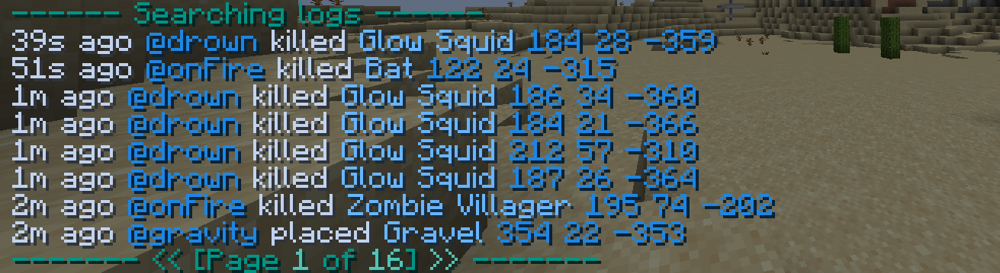

# Search
`/ledger search`  
Alias: `s`  
Permission: `ledger.commands.search`

---

### `/ledger search <params>`
Often, inspecting just one position is not what you want.
The search command allows you to preform advanced queries on the database.
To refine your search, use search [parameters](../parameters.md).
After executing your search, you will see all the results and can paginate between them if needed.

| `Display:` | Time ago   | Source of the action | Action that occurred | Object that was changed | Location          |
|------------|------------|----------------------|---------------------|-------------------------|-------------------|
| `Hover:`   | Exact time |                      | Action identifier   | Object identifier       | Teleport on click |

*Order can be customized, see [configuration](../config.md)*
