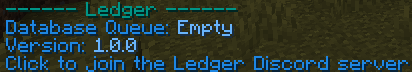

# Status
`/ledger status`  
Alias: None  
Permission: `ledger.commands.status`

---

### `/ledger status`
This command will give you the following information.

| Info         | Explanation                                                     |
|--------------|-----------------------------------------------------------------|
| Version      | The current version of Ledger on your server                    |
| Queue Status | Whether or not the [queue](../queue.md) is **free** or **busy**.|
| Discord      | A link to the Fabric Server Tools discord for support           |

